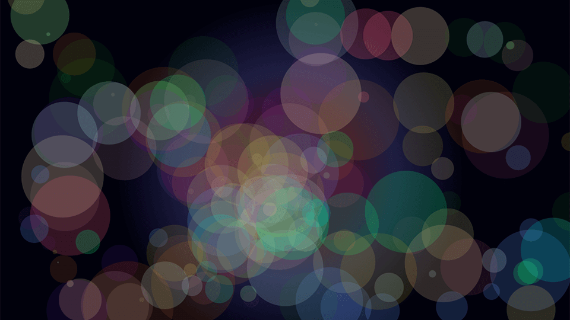

# Pulsating Circle

🤖 AI-Assited (ChatGPT 4o)

The "Pulsating Circle" project is an interactive web-based visualization that demonstrates dynamic circle animations using JavaScript and CSS. This experimental piece showcases the use of HTML5 canvas for rendering and animating graphics, and it leverages CSS for styling effects. Users can observe a circle that changes in size and color, creating a pulsating effect.

## Site
* 👉 [jsohndata.github.io/pulsating-circle/](https://jsohndata.github.io/pulsating-circle/)
